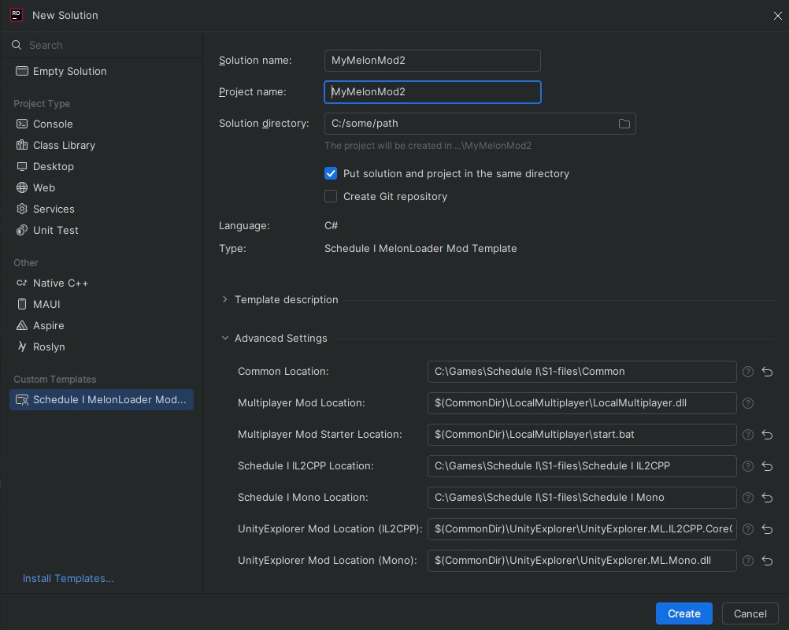

# Schedule I MelonLoader Mod Template

This is a template for creating a MelonLoader mod for the game "Schedule I". It includes a basic structure and example code to help you get started.

## Features
- Basic mod structure
- Useful methods for cross-backend compatibility
- Cross-backend compatibility: IL2CPP (none/beta branch) and Mono (alternate/alternate-beta branch)
- Easy build and test process: Select the target configuration, build the mod and the game will be launched automatically
- Automatic testing mod loading: Comment/uncomment lines in .csproj to enable/disable automatic loading of often used mods like UnityExplorer, LocalMultiplayer

## Usage
### Prerequisites
- [MelonLoader](https://melonwiki.xyz/) and basic knowledge of how to use it
- .NET SDK (as per MelonLoader requirements)
- C# IDE (e.g. Rider)
- [Schedule I](https://store.steampowered.com/app/3164500) ownership

#### Preparing the directory structure
I recommend following structure:
```
S1-modding
├── common
│   ├── LocalMultiplayer
│   └── UnityExplorer
├── gamefiles
│   ├── Schedule I IL2CPP
│   └── Schedule I Mono
```

`LocalMultiplayer` directory should contain the mod file `.dll` and `.bat` starter.
Example starter:
```bat
start "" "Schedule I.exe" --host --adjust-window --left-offset 0
timeout /t 1
start "" "Schedule I.exe" --join --adjust-window --left-offset 20
```

`UnityExplorer` directory should contain `.dll` files for IL2CPP and Mono versions of the mod.

`gamefiles` directory should contain the game files for IL2CPP and Mono versions of the game. You can use the `Schedule I IL2CPP` and `Schedule I Mono` directories to store the game files for each version.

### Usage
#### Installation
To install this template, use:
```
dotnet new install k073l.S1MelonMod
```

#### Creating a new mod
To create a new mod you can use the new solution wizard:

Alternatively, you can create a new project using the command line:
```
dotnet new S1MelonMod -n MyNewMod \
  --S1MonoDir "" \
  --S1IL2CPPDir ""
```
#### Parameters
| Name                  | Required | Description                                                              |
|-----------------------|----------|--------------------------------------------------------------------------|
| S1MonoDir             | Yes      | Path to the Mono version of the game.                                    |
| S1IL2CPPDir           | Yes      | Path to the IL2CPP version of the game.                                  |
| CommonDir             | No       | Path to the common directory. (helper path, mostly useful as a variable) |
| UnityExplorerMono     | No       | Path to the Mono version of the UnityExplorer mod.                       |
| UnityExplorerIL2CPP   | No       | Path to the IL2CPP version of the UnityExplorer mod.                     |
| MultiplayerModMono    | No       | Path to the Mono version of the LocalMultiplayer mod.                    |
| MultiplayerModIL2CPP  | No       | Path to the IL2CPP version of the LocalMultiplayer mod.                  |
| MultiplayerModStarter | No       | Path to the LocalMultiplayer mod starter bat file.                       |

You can use parameters to set the paths of other params. For example, you can set the `CommonDir` parameter to the path of the common directory, and then use it to set the paths of the `UnityExplorerMono`, `UnityExplorerIL2CPP`, `MultiplayerModMono`, and `MultiplayerModIL2CPP` parameters. This way, you can keep your configurations readable.

### Additional information
Information on S1 modding can be found in the [S1 modding discord](https://discord.gg/9Z5RKEYSzq).

## Bundled methods
#### MelonLogger Extension
`Debug` method allows you to log messages only when mod is built in Debug configuration. Additionally, it automatically logs caller info.
```csharp
private static MelonLogger.Instance _logger = new MelonLogger.Instance("MyMod"); // logger instance needs to be created
_logger.Debug("This message will be logged only in Debug configuration");
```
#### Il2CppList Extension
`ToIl2CppList<T>` makes converting `List<T>` to `Il2CppList<T>` easier.
```csharp
List<int> list = new List<int> { 1, 2, 3 };
Il2CppSystem.Collections.Generic.List<int> il2cppList = list.ToIl2CppList();
```
`ConvertToList<T>` naturally, converts `Il2CppList<T>` to `List<T>`.
```csharp
Il2CppSystem.Collections.Generic.List<int> il2cppList = new Il2CppSystem.Collections.Generic.List<int> { 1, 2, 3 };
List<int> list = il2cppList.ConvertToList();
```
#### Utils
`FindObjectByName<T>` finds loaded object by name.
```csharp
var sprite = Utils.FindObjectByName<Sprite>("MySprite");
```
`GetAllComponentsInChildrenRecursive<T>` gets all components of type `T` in children of the object.
```csharp
var components = Utils.GetAllComponentsInChildrenRecursive<MyComponent>(myGameObject);
```
`Is<T>` checks and casts object to type `T`.
```csharp
if (Is<MyComponent>(someObj, out var res))
{
    // res is MyComponent
}
```
`GetAllStorableItemDefinitions` returns all storable item definitions from the registry.
```csharp
var allStorableItemDefinitions = Utils.GetAllStorableItemDefinitions();
var item = allStorableItemDefinitions.FirstOrDefault(x => x.ID == "cuke");
```
